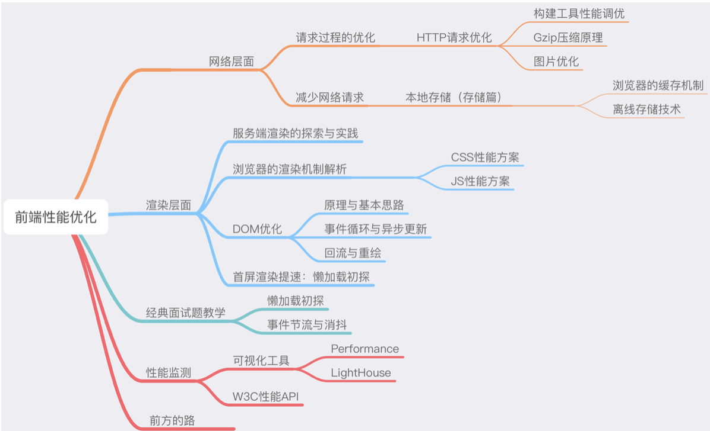

一道绝对的老生常谈的面试题：

> 从输入 URL 到页面加载完成，发生了什么？

我们站在性能优化的角度，来简单地复习一遍这个经典的过程: 首先我们需要通过 DNS(域名解析系统)将 URL 解析为对应的 IP 地址，然后与这个 IP 地址确定的那台服务器建立起 TCP 网络连接，随后，我们想服务器抛出我们的 HTTP 请求，服务器处理完我们的请求后，把目标数据放在 HTTP 响应里返回给客户端，拿到相应数据的浏览器就可以开始走一个渲染的流程。 渲染完毕，页面便呈现给了用户，并时刻等待响应用户的操作。

上述过程切分为以下过程片段：

1. DNS 解析
2. TCP 连接
3. HTTP 请求抛出
4. 服务端处理请求，HTTP 响应返回
5. 浏览器拿到响应数据，解析响应内容，把解析的结果展示给用户

下面我将通过原理到实践，把上述的几个过程难点逐个击破

问题一： DNS 解析花时间，能不能尽量减少解析次数或者把解析前置？
回答：可以，浏览器 DNS 缓存 和 DNS prefetch(DNS prefetch 我不是太了解啊)

问题二： TCP 每次的三次握手都急死人，有没有解决方案？ 有--长连接、预连接、接入 SPDY 协议。

---

(前两个问题，前端单方面能够做的努力有限)
但是后面的关于网络层面的性能优化以及浏览器端的性能优化(涉及资源加载优化、服务端渲染、浏览器缓存机制的利用、DOM 树的构建、网页排版和渲染过程、回流与重绘的考量、DOM 操作的合理规避等等)

