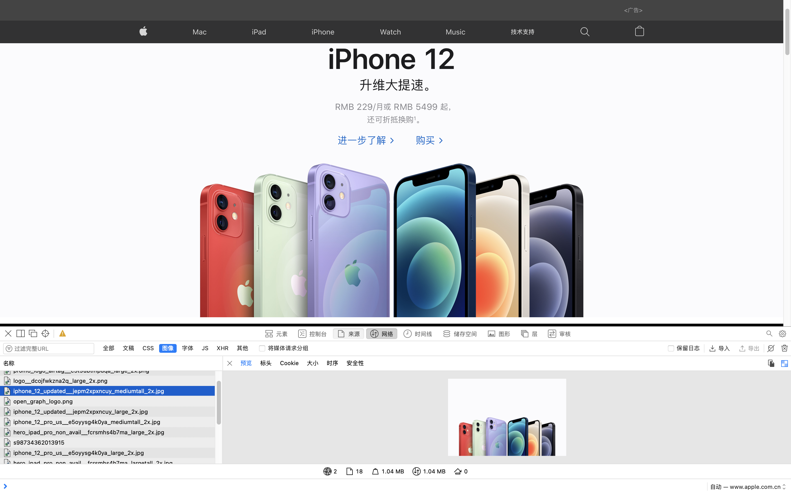
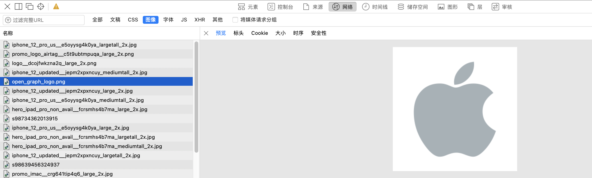

#### 图片优化--质量与性能的博弈

我们要做的事情是去压缩图片的体积(或者一开始就选取体积较小的图片格式)。但这个优化操作，是以牺牲一部分成像质量为代价的。因此我们的主要任务是尽可能地去寻找一个质量与性能间的平衡点

在所有请求的资源中，图片所占的体积比例其实太大了

##### 前置知识：二进制位数与色彩的关系

在计算机中，像素用二进制数来表示。不同的图片格式中像素与二进制位数之间的对应关系是不同的。一个像素对应的二进制位数越多，它可以表示的颜色种类就越多，成像效果也就越细腻越逼真(所以说，屏幕呈现的效果不光看分辨率是多少，还要看每个像素点展现的质量如何)，文件体积相应也会越大。

一个二进制位表示两种颜色(0|1 对应黑|白)，如果一种图片格式对应的二进制位数有 n 个，那么它就可以呈现 2^n 种颜色

##### JPEG/JPG

关键字：有损压缩、体积小、加载快、不支持透明

###### JPG 的优点

JPG 最大的特点是有损压缩。这种高效的压缩算法使它成为了一种非常轻巧的图片格式。 另一方面，即使被称为“有损”压缩，JPG 的压缩方式仍然是一种高质量的压缩方式：当我们把图片体积压缩至原有体积的 50% 以下时，JPG 仍然可以保持住 60% 的品质。此外，JPG 格式以 24 位存储单个图，可以呈现多达 1600 万种颜色(2^24 = 16777216)，足以应对大多数场景下对色彩的要求，这一点决定了它压缩前后的质量损耗并不容易被我们人类的肉眼所察觉——前提是你用对了业务场景。

###### 使用场景

JPG 适用于呈现色彩丰富的图片，在我们日常开发中，JPG 图片经常作为大的背景图、轮播图或 Banner 图出现。

甚至在苹果官网上 对大图片也是用的 jpg 图片：

使用 JPG 呈现大图，既可以保住图片的质量，又不回带来令人头疼的图片体积，是当下比较推崇的一种方案

###### JPG 的缺陷

有损压缩在上文所展示的轮播图上确实很难露出马脚，但当它处理`矢量图形`和`Logo`等线条感较强、颜色对比强烈的图像时，人为压缩导致的图片模糊会相当明显。(矢量图形是啥？)
此外，JPEG 图像`不支持透明度处理`, 透明图片需要召唤 PNG 来呈现。 (难道无法用 css 的 opacity 来处理？)

###### PNG-8 与 PNG-24

关键字： 无损压缩、质量高、体积大、支持透明

###### PNG 的优点(mac 截图都是 png)

PNG (可移植网络图形格式) 是一种无损压缩的高保真的图片格式。 8 和 24，这里都是二进制数的位数。按照我们前置知识里提到的对应关系，8 位的 PNG 最多支持 256 种颜色，而 24 位的可以呈现约 1600 万种颜色。 PNG 图片具有比 JPG 更强的色彩表现力，对线条的处理更加细腻，对透明度有良好的支持，它弥补了上文我们提到的 JPG 的局限性，唯一的 BUG 就是`体积太大`。

###### PNG-8 与 PNG-24 的选择题

什么时候用 PNG-8，什么时候用 PNG-24，这是一个问题。
理论上来说，当你追求最佳的显示效果、并且不在意文件体积大小时，是推荐使用 PNG-24 的(PNG-24 是能够显示最好的效果的吗 如何分辨 PNG-8 还是 PNG-24 呢)。
如何确定一张图片是该用 PNG-8 还是 PNG-24 去呈现呢？好的做法是把图片先按照这两种格式分别输出，看 PNG-8 输出的结果是否会带来肉眼可见的质量损耗，并且确认这种损耗是否在我们（尤其是你的 UI 设计师）可接受的范围内，基于对比的结果去做判断。

###### 应用场景

前面我们提到，复杂的、色彩层次丰富的图片，用 PNG 来处理的话，成本会比较高，我们一般会交给 JPG 去存储。

考虑到 PNG 在处理线条和颜色对比度方面的优势，我们主要用它来呈现小的 Logo、颜色简单且对比强烈的图片或背景等。
下图，苹果官网 Logo 就是

##### SVG

关键字： 文件文件、体积小、不失真、兼容性好

这个 SVG 我见是见过，但感觉挺难的，也不知道如何使用。
SVG(可缩放矢量图形)是一种基于 XML 语法的图像格式。它和文本提及的其他图片种类有着本质的不同：`SVG 对图像的处理不是基于像素点，而是基于对图像的形状描述`

SVG 是一种矢量图?

###### SVG 的特性

和性能关系最密切的一点就是：SVG 与 PNG 和 JPG 相比，文件体积更小，可压缩性更强

当然，作为矢量图，它最显著的优势还是在于`图片可无限放大而不失真`这一点上。这使得 SVG 即使是被放到视网膜屏幕上，也可以一如既往地展现出较好的成像品质——1 张 SVG 足以适配 n 种分辨率。

此外，`SVG 是文本文件`。我们既可以像写代码一样定义 SVG，把它写在 HTML 里、成为 DOM 的一部分，也可以把对图形的描述写入以 .svg 为后缀的独立文件（SVG 文件在使用上与普通图片文件无异）。这使得 SVG 文件可以被非常多的工具读取和修改，具有较强的`灵活性`。

SVG 的局限性主要有两个方面，一方面是它的渲染成本比较高，这点对性能来说是很不利的。另一方面，SVG 存在着其他图片格式所没有的学习成本(它是可编程的)。

###### SVG 的使用方式与应用场景

`SVG 是文本文件`，我们即可以像写代码一样定义 SVG，把它写在 HTML 里、成为 DOM 的一部分，也可以把对图形的描述写入以.svg 为后缀的独立文件(SVG 文件在使用上与普通图片文件无异)。这使得 SVG 文件可以被非常多的工具读取和修改，具有较强的`灵活性`。

##### Base64

关键字：文本文件、依赖编码、小图标解决方案
(前置条件：每次加载图片，都是需要想服务器请求这个图片对应的资源(svg 也是吗？)---这也就意味着一次 http 请求的开销)
Base64 是一种用于传输 8bit 字节码的编码方式，通过对图片进行 Base64 编码，我们可以直接将编码结果写入 HTML 或者写入 CSS，从而减少 HTTP 请求的次数。

这是因为，Base64 编码后，图片大小会膨胀为原文件的 4/3（这是由 Base64 的编码原理决定的）。如果我们把大图也编码到 HTML 或 CSS 文件中，后者的体积会明显增加，即便我们减少了 HTTP 请求，也无法弥补这庞大的体积带来的性能开销，得不偿失。
在传输非常小的图片的时候，Base64 带来的文件体积膨胀、以及浏览器解析 Base64 的时间开销，与它节省掉的 HTTP 请求开销相比，可以忽略不计，这时候才能真正体现出它在性能方面的优势。
(相当于有两点需要知道： 1. 文件体积会膨胀 2. 浏览器解析 Base64 是需要花费时间的)

###### 使用 Base64 的条件

- 图片的实际尺寸很小(不超过 2kb 吧？！)
- 图片无法以雪碧图的形式与其它小图结合（合成雪碧图仍是主要的减少 HTTP 请求的途径，Base64 是雪碧图的补充）
- 图片的更新频率非常低（不需我们重复编码和修改文件内容，维护成本较低）

小总结： 最好通过 webpack 来进行 Base64 的编码

##### WebP

太年轻(其实现在没必要花费时间来研究这个)
