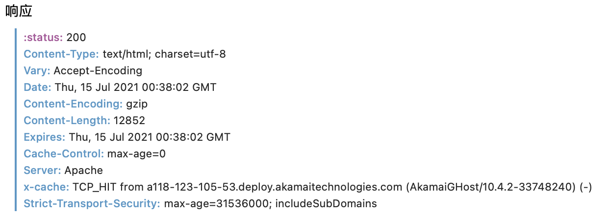
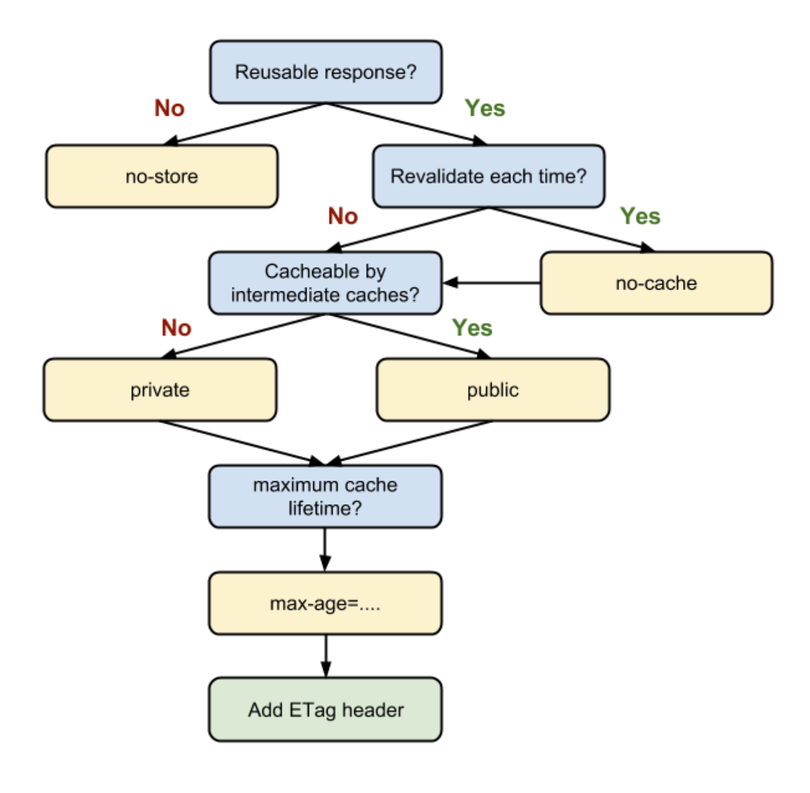

### 浏览器缓存机制介绍与缓存策略剖析

(跟 http 缓存不知道有没有关)

> 缓存可以减少网络 IO 消耗，提高访问速度 (这句话感觉说得有点专业呀)

> 浏览器缓存是一种操作简单、效果显著的前端性能优化手段

```
  通过网络获取内容既速度缓慢又开销巨大。较大的响应需要在客户端与服务器之间进行多次往返通信，这会延迟浏览器获得和处理内容的时间，还会增加访问者的流量费用。因此，缓存并重复利用之前获取的资源的能力成为性能优化的一个关键方面。
```

大家倾向于将浏览器缓存简单地理解为"HTTP 缓存"，但事实上，浏览器缓存机制有四个方面，按照获取资源时请求的优先级依次排列如下：

1. Memory Cache
2. Service Worker Cache
3. HTTP Cache (最主要、最具有代表性的缓存策略，也是每一位前端工程师都应该深入理解掌握的性能优化知识点)
4. Push Cache (HTTP2 的新特性)

#### HTTP 缓存机制探秘

HTTP 缓存是我们日常开发中最为熟悉的一种缓存机制。分为`强缓存` 和 `协商缓存`。(双越的面试视频里其实都谈及过这方面的内容的) `强缓存`优先级更高，在命中强缓存失败的情况下，才会走协商缓存。

#### 强缓存的特征

强缓存是利用 http 头中的 Expires 和 Cache-Control 两个字段来控制的。强缓存中，当请求`再次`发出时，`浏览器`会根据其中的 expires 和 cache-control 判断目标资源是否“命中”强缓存，若命中则直接从缓存中获取资源，`不会再与服务端发生通信`

命中强缓存的情况下，返回的 HTTP 状态码为 200

在过去，我们实现强缓存一直使用的是 expires。 当服务器返回响应时，在 Response Headers 中将过期时间写入 expires 字段。
下图为 Safari 控制台截图

专门再给 expires 一个特写：

> Expires: Thu, 15 Jul 2021 00:38:02 GMT

expires 是一个时间戳。如果我们再次向服务器请求资源，`浏览器`就会先对比本地时间和 expires 的时间戳，如果本地时间小于 expires 设定的过期时间，那么就直接去缓存中取这个资源。由于时间戳是服务器来定义的，而本地时间的取值却来自客户端，因此 expires 的工作机制对客户端时间与服务器时间之间的一致性提出了极高的要求，若服务器与客户端存在时差，将带来意料之外的结果。(估计这就是为什么我以前电脑的时间有问题，连游戏也登录不成功的原因吗？)

如果说 expires 是通过`绝对的时间戳`来控制缓存过期时间，相应地，`Cache-Control`中的`max-age`字段允许我们通过`相对的时间长度`来达到同样的目的。

(注意，在当下的前端实践里，我们普遍会倾向于使用 max-age。但是如果你的应用对向下兼容有强诉求，那么 expires 仍然是不可缺少的)

给上图中的 Cache-Control 字段一个特写：

> cache-control: max-age=0

其实，在 Cache-Control 中，我们通过 max-age 来控制资源的有效期。max-age 不是一个时间戳，而是一个时间长度。 单位是 s

注意，max-age 是一个相对时间，这就意味着它有能力规避掉 expires 可能会带来的时差问题：max-age 机制下，资源的过期判定不再受服务器时间戳的限制。客户端会记录请求到资源的时间点，以此作为相对时间的起点，从而确保参与计算的两个时间节点（起始时间和当前时间）都来源于客户端，由此便能够实现更加精准的判断。

**Cache-Control 的 max-age 配置项相对于 expires 的优先级更高。当 Cache-Control 与 expires 同时出现时，我们以 Cache-Control 为准。**

##### Cache-Control 应用分析

Cache-Control 的神通，可不止于这一个小小的 max-age。如下的用法也非常常见

> cache-control: max-age=3600, s-maxage = 31536000

**s-maxage 优先级高于 max-age，两者同时出现时，优先考虑 s-maxage。如果 s-maxage 未过期，则向代理服务器请求其缓存内容。**
这个 s-maxage 不像 max-age 一样为大家所熟知。的确，在项目不是特别大的场景下，max-age 足够用了。但在依赖各种代理的大型架构中，我们不得不考虑代理服务器的缓存问题。s-maxage 就是用于表示 cache 服务器上（比如 cache CDN）的缓存的有效时间的，并只对 public 缓存有效。

注意：s-maxage 仅在代理服务器中生效，客户端中我们只考虑 max-age

###### public 与 private

public 与 private 是针对资源是否能够被代理服务器缓存而存在的一组对立概念

如果我们为资源设置了 public，那么它既可以被浏览器缓存，也可以被代理服务器缓存；如果我们设置了 private，则该资源只能被浏览器缓存。private 为`默认值`。

###### no-store 与 no-cache

no-cache 绕开了浏览器：我们为资源设置了 no-cache 后，每一次发送请求都不会再去询问浏览器的缓存情况，而是直接向服务器端去确认该资源是否过期(其实就是后面要说的协商缓存需要弄的东西)

no-store(不允许缓存) 顾名思义就是不适用任何缓存策略。在 no-cache 的基础上，它连服务端的缓存确认也绕开了，只允许你直接向服务端发送请求、并下载完整的响应

#### 协商缓存：浏览器与服务器合作之下的缓存策略

协商缓存依赖于服务端与浏览器之间的通信

协商缓存机制下，浏览器需要向服务器去询问缓存的相关信息，进而判断是重新发起请求、下载完整的响应，还是从本地获取缓存的资源。

如果服务端提示缓存资源未改动（Not Modified），资源会被重定向到浏览器缓存，`这种情况下网络请求对应的状态码是 304`

对于缓存需求的决策，Chrome 给出了官方的流程图：

